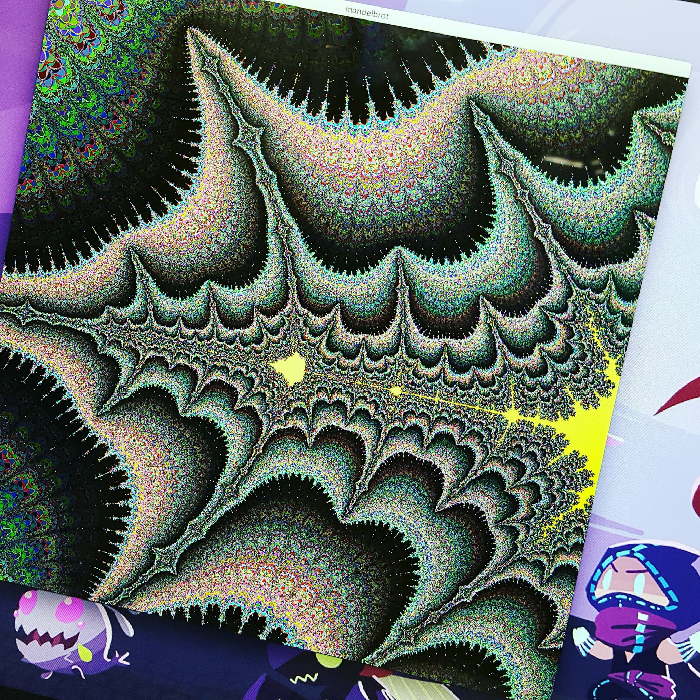

# Fract'ol

Date du projet : 2017/07/15

Second projet de la branche graphique ayant pour but l'apprentissage de l'optimisation et de certaines notions mathematique (nombre complex).

Bases du projet : Afficher 3 fractal dont 2 imposer (Julia, Mandelbrot) et dans mon cas la 3eme Burningchip.

Option bonus : interface utlisateur, large choix de couleur, la couleur change en fonction des iterration, 
zoom dans la limite de la machine, modification de l'intervale en fonction de la souris.

 

